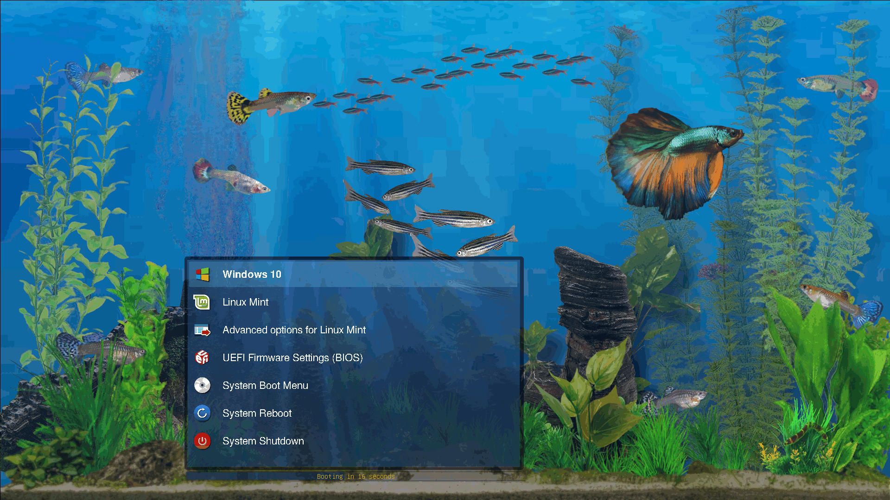

# Freshwater-Aquarium - Grub theme #   
### Designed for 1920x1080 Resolution ###  
### Created by @texxasrulez ###  

### Latest Screenshot ###  

  

### Included Icons ###  

| Operating System & Logo																		| Operating System & Logo																	| Operating System & Logo																		| Operating System & Logo																				|
|:---																							|:---																						|:---																							|:---																									|
| Alt Linux 			| FreeBSD 			| OpenMandrivia 	| Ubuntu 						|
| Android 				| Frugalware 	| OpenSuse 			| Ubuntu Gnome 			|
| Antergos 			| Gentoo 			| PC-BSD 				| Ubuntu Gnome Alt 	|
| Antix 					| GhostBSD  		| PCLinuxOS 			| Ubuntu Kylin 			|
| Apricity 			| Haiku 				| PhoenixOS  		| Ubuntu Mate 				|
| Arch Linux 				| Hardware Test 	| Pop OS  				| UEFI 							|
| Arco Linux 		| Kali Linux 			| Puppy Linux 			| Unknown 						|
| Boot CD 				| Korora 			| RedHat 				| Windows 						|
| CentOS 					| Kubuntu 			| Refind 				| Xubuntu 						|
| Chakra 				| Legacy 			| RemixOS 				| Zorin 							|
| Chrome 				| Linux  			| System Restart 		|																										|
| Clover 				| Linux Mint 	| Rosa 					|																										|
| Core 					| Lubuntu 			| Sabayon 				|																										|
| Crunchbang 		| Mac 					| System Shutdown 	|																										|
| Debian 				| Mac Alt 			| Siduction 			|																										| 
| Deepin 				| Mageia 			| Slackware 			|																										|
| Edubuntu 			| Mandrivia 		| Solus 					|																										|
| Elementary 		| Manjaro 			| Sparky 				|																										|
| Endeavour OS 	| MXLinux 			| Steam 					|																										|
| Endless OS 		| Neon 				| Submenu Icon 		|																										|
| Fatdog 				| Network 			| Suse 					|																										|
| Fedora 				| OpenBSD 			| Tails Linux 			|																										|

**Installation**  
run `sudo bash install.sh`

This will copy files to /usr/share/grub/themes, backup current grub config then it will edit grub.cfg and execute  
update-grub / grub-mkconfig to make "Bikini Atoll" your default Grub2 Bootloader Theme.  

Upon next reboot, Bikini Atoll will be your boot screen.  

**USE at your OWN Risk!**  

:moneybag: **Donations** :moneybag:

If you use this theme and would like to show your appreciation by buying me a cup of coffee, I surely would appreciate it.  
A regular cup of Joe is sufficient, but a Starbucks Coffee would be better ...  
Zelle (Zelle is integrated within many major banks Mobile Apps by default) - Just send to texxasrulez at yahoo dot com  
No Zelle in your banks mobile app, no problem, just click [Paypal](https://paypal.me/texxasrulez?locale.x=en_US) and I can make a Starbucks run ...

I appreciate the interest in this theme and wish nothing but the best for all ...  
